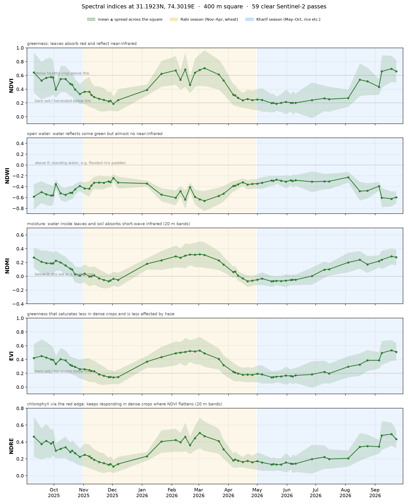
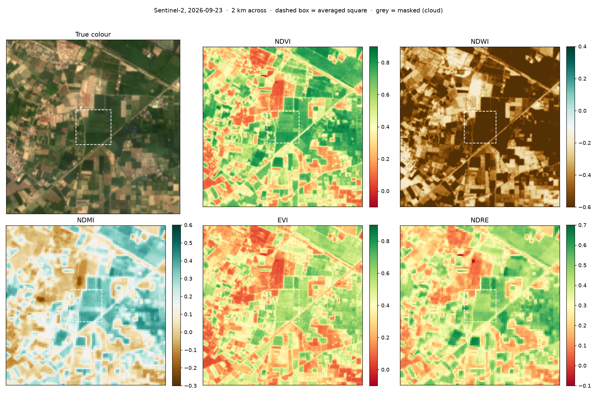
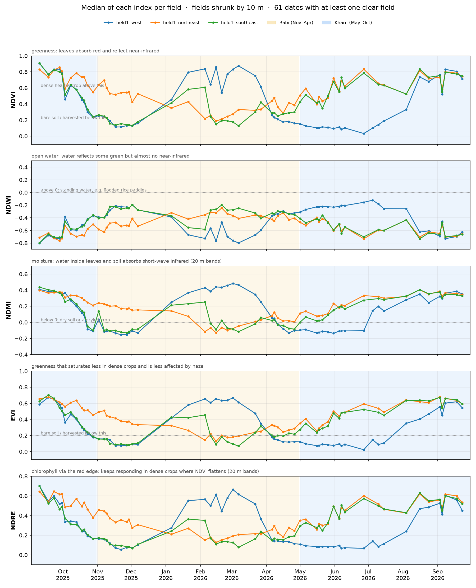
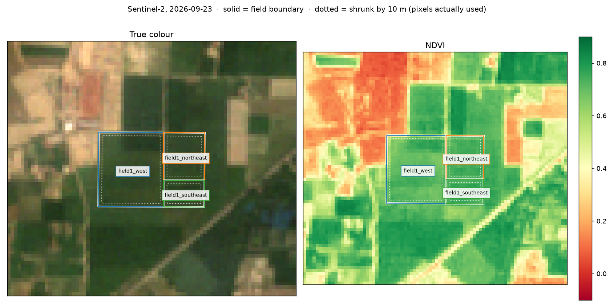
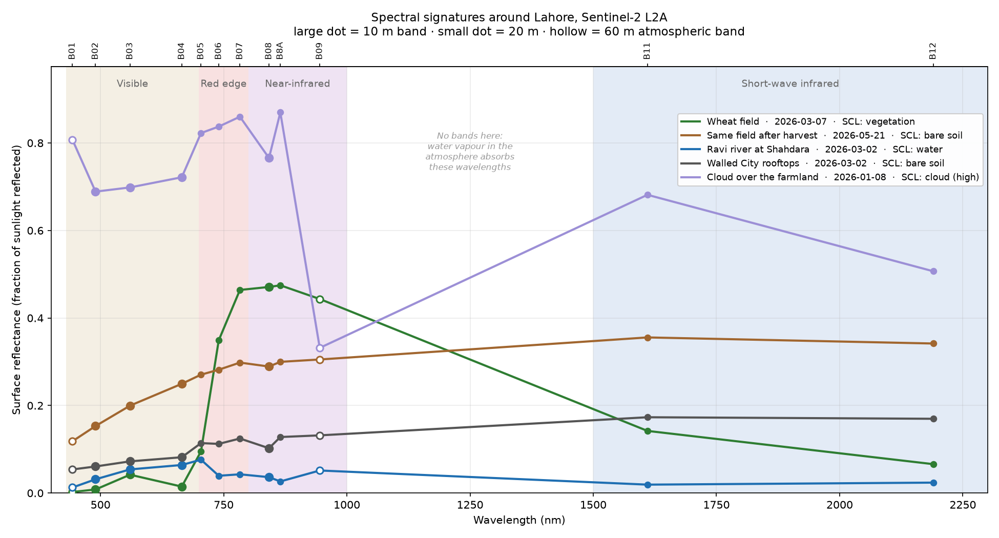

# crop_project

Crop health in Punjab from space. Pulls free Sentinel-2 satellite images for any spot,
masks out clouds, and tracks greenness, water and moisture indices every ~5 days.

A learning project: I'm using it to build up satellite imaging and ML skills step by step,
alongside Stanford CS229. See the [roadmap](#roadmap) for where it's going.



The panels above are a 400 m block of farmland between Raiwind and Kasur, Sep 2025 – Sep 2026.
Punjab's whole farming year is visible: rice peaking in September, the harvest dip in Oct–Nov,
wheat peaking in early March, the April harvest, fallow summer, and rice again.



## Indices

| Index | Measures | Formula | Pixel size |
|---|---|---|---|
| **NDVI** | greenness | (NIR − red) / (NIR + red) | 10 m |
| **NDWI** | open water | (green − NIR) / (green + NIR) | 10 m |
| **NDMI** | moisture in leaves and soil | (NIR narrow − SWIR1) / (NIR narrow + SWIR1) | 20 m |
| **EVI** | greenness, less saturated in dense crops, less affected by haze | 2.5 (NIR − red) / (NIR + 6 red − 7.5 blue + 1) | 10 m |
| **NDRE** | chlorophyll, via the red edge; keeps responding where NDVI flattens | (NIR narrow − red edge 1) / (NIR narrow + red edge 1) | 20 m |

Adding another index is one entry in the `INDICES` table at the top of `s2_indices.py`.

## How it works

```
Sentinel-2 L2A scenes on Microsoft Planetary Computer (free, no account)
  │  STAC search: point + date range + scene cloud < 50%, one scene per day
  ▼
For each scene (8 in parallel)
  │  lat/lon → UTM metres → pixel window
  │  HTTP range reads of just that window from the Cloud-Optimized GeoTIFFs,
  │    only for the bands the chosen indices need, plus the SCL cloud classification
  │  20 m bands (B05, B8A, B11, SCL) upsampled to the 10 m grid with nearest neighbour
  │  keep vegetation / soil / water pixels, drop the scene if < 80% of the square is clear
  │  reflectance = (DN − 1000) / 10000   (offset applies from processing baseline 04.00)
  │  each index per pixel → mean and spread over the square
  ▼
output/indices.csv, indices_timeseries.png, indices_map.png
```

Only a few hundred KB are downloaded per band per scene, instead of the full ~100 MB tile,
so a year of all four indices takes about a minute.

## Setup (Windows)

Needs Python 3.12+.

```powershell
py -m venv .venv
.venv\Scripts\activate
pip install -r requirements.txt
```

## Run

```powershell
python s2_indices.py                              # default: farmland between Raiwind and Kasur
python s2_indices.py --lat 31.30 --lon 74.07      # any other spot (copy lat/lon from Google Maps)
python s2_indices.py --indices NDVI,NDMI          # only some indices (fewer bands, faster)
python s2_indices.py --size 200                   # smaller square = closer to a single field
python s2_indices.py --start 2023-11-01 --end 2024-05-31   # one wheat season
```

Run `python s2_indices.py --help` for all options (cloud thresholds, map size, output folder).

## Reading the charts

- **NDVI**: below ~0.2 is bare soil or a harvested field; above ~0.6 is dense healthy crop.
- **NDWI** is mostly negative over farmland; it goes above 0 only over open water.
- **NDMI** rises with water in the canopy and in wet soil, and drops below 0 when fields dry out.
- **EVI** follows NDVI on a lower scale, but saturates less at peak growth and shrugs off thin haze.
- **NDRE** peaks and starts falling earlier than NDVI as the wheat ripens and loses chlorophyll.
- The shaded band is the spread across the square. It's wide because a 400 m square covers
  several fields with different crops.
- In the NDMI map the 20 m pixels show as visibly bigger blocks.

## Per-field statistics

`s2_fields.py` does the same per field instead of per square. Field boundaries come from
`fields.geojson` (drawn on geojson.io, one polygon per field, with a `name` property).
Each field is shrunk inwards by 10 m so only pixels entirely inside it count, and a field is
skipped on a date unless at least 80% of its own pixels are cloud-free.

```powershell
python s2_fields.py                                  # fields.geojson, all indices
python s2_fields.py --fields my_fields.geojson --indices NDVI,NDMI
python s2_fields.py --buffer 20                      # shrink by 20 m (stricter for 20 m bands)
```

Before downloading anything it prints each field's size and how many pure 10 m and 20 m
pixels it has, since small fields leave very few 20 m pixels for NDMI and NDRE.
Results go to `output/fields.csv` (one row per field per clear date: mean, median and spread
of each index), `fields_timeseries.png` and `fields_map.png`.



The three fields here looked like one block of rice in September, but they are farmed
differently the rest of the year: `field1_west` follows the classic rice–wheat rotation
(wheat peaks in March, then a bare summer with standing water in July before rice),
while both eastern fields carry shorter crops in winter and green up again by June.



## Spectral signatures

`spectral_signatures.py` samples all 12 Sentinel-2 L2A bands at five verified pixels
and plots reflectance against wavelength: a wheat field at its peak, the same field after
harvest, the Ravi at Shahdara, Walled City rooftops, and a cloud.

```powershell
python spectral_signatures.py      # edit TARGETS in the file to try your own pixels
```



## Roadmap

Each step adds a feature and teaches one concept.

**Satellite fundamentals**
- [x] NDVI time series from Sentinel-2 with cloud masking
- [x] Spectral signatures: all bands for crop, soil, water, city and cloud pixels
- [x] More indices: NDWI, NDMI (SWIR, 20 m), EVI, NDRE (red edge)
- [x] Real field boundaries (GeoJSON polygons) instead of a square
- [ ] Better cloud masking: explain every dip, buffer cloud edges
- [ ] Local cache + gap-filled, smoothed 5-day time series

**Machine learning (CS229)**
- [ ] Labelled dataset of 60–100 fields by crop system
- [ ] Crop classification: logistic regression, SVM, gradient-boosted trees, with spatial cross-validation
- [ ] Write-up

**Radar and deep learning**
- [ ] Area-scale processing with odc-stac + xarray
- [ ] Sentinel-1 radar time series; 2022 flood mapping
- [ ] U-Net crop map with TorchGeo
- [ ] Benchmark geospatial foundation models (Prithvi, Clay) against the classical baseline

## Data

Contains modified Copernicus Sentinel data, accessed through
[Microsoft Planetary Computer](https://planetarycomputer.microsoft.com/dataset/sentinel-2-l2a).
