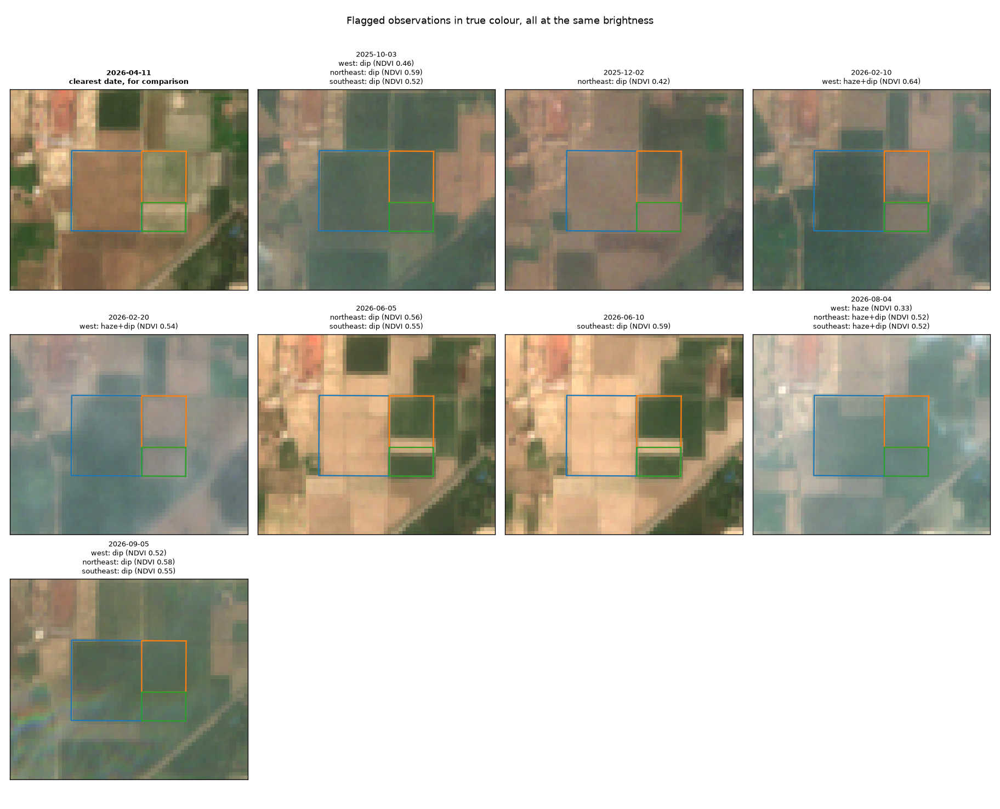
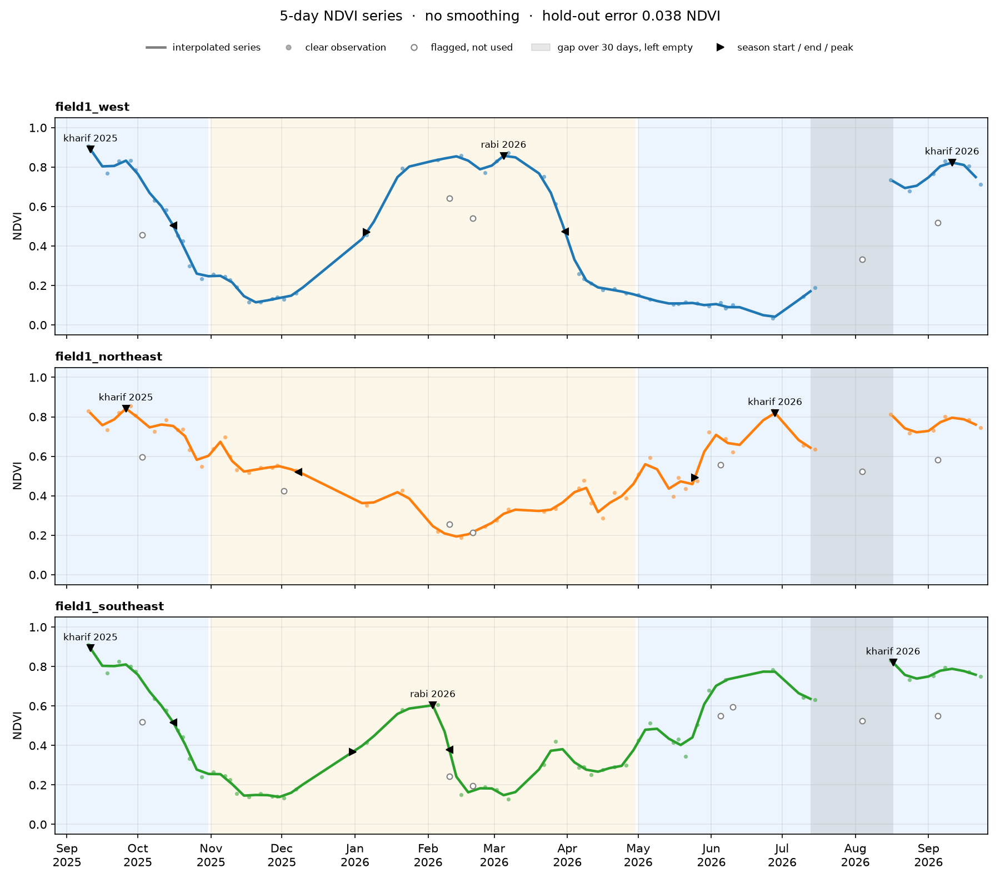
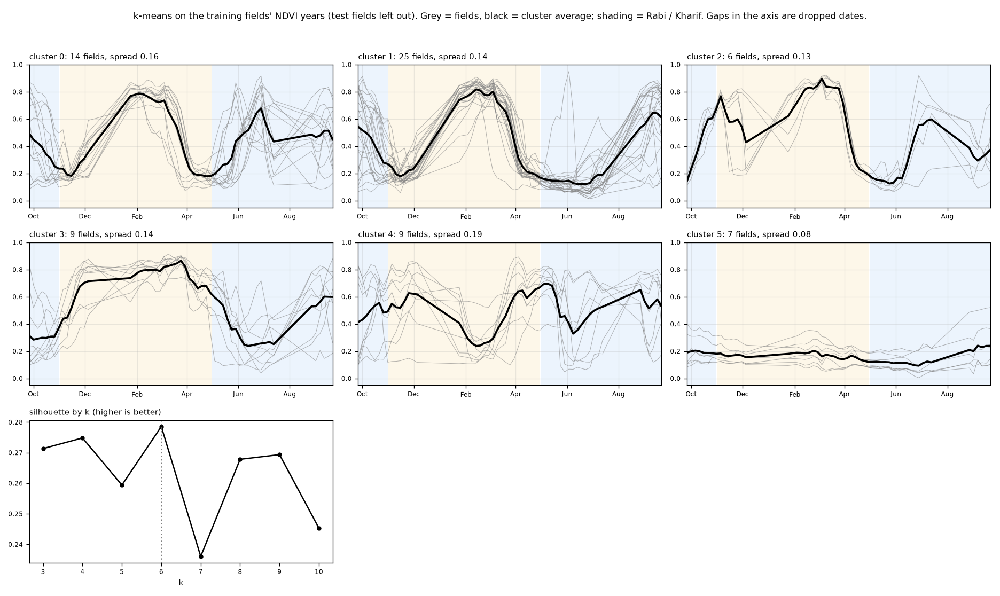
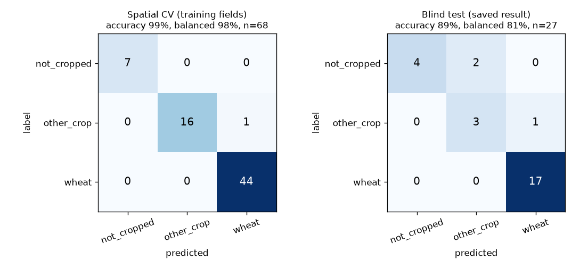
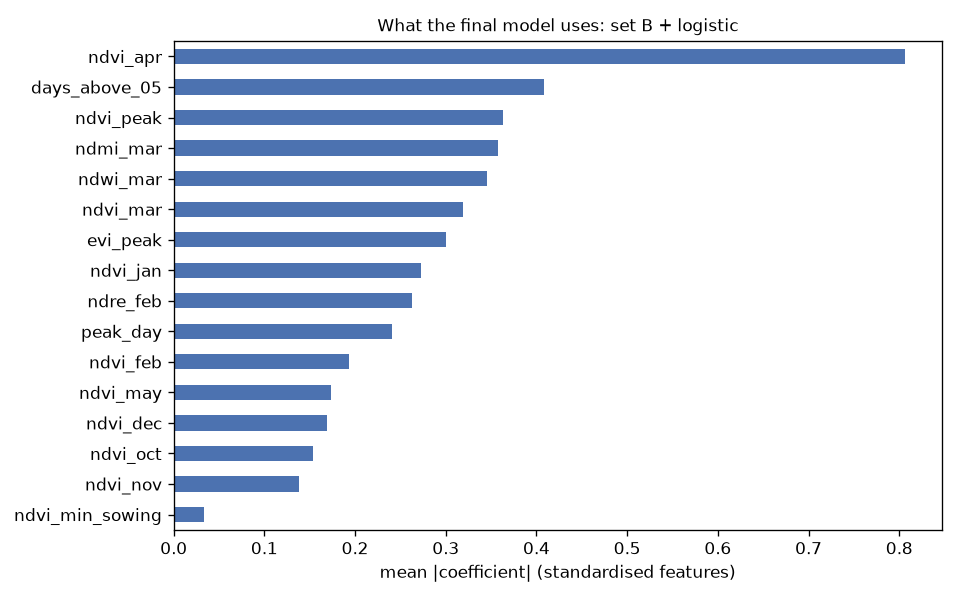
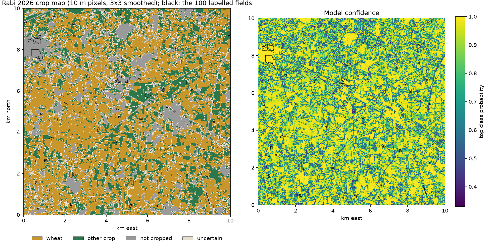
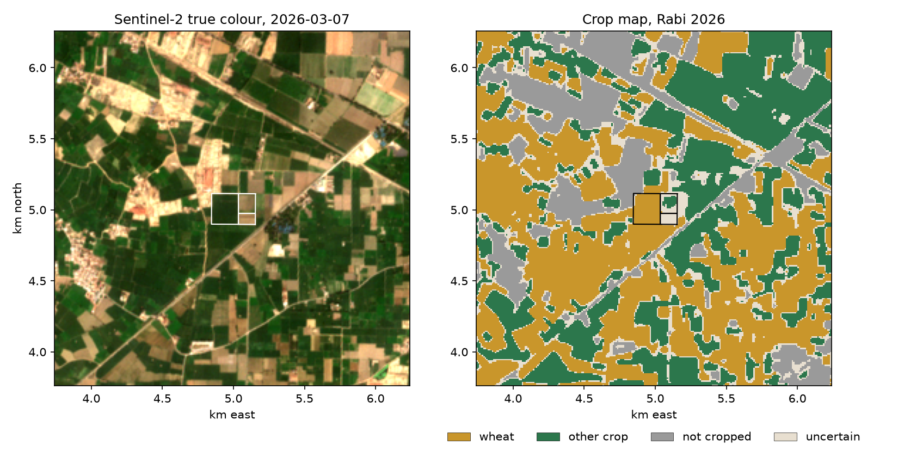
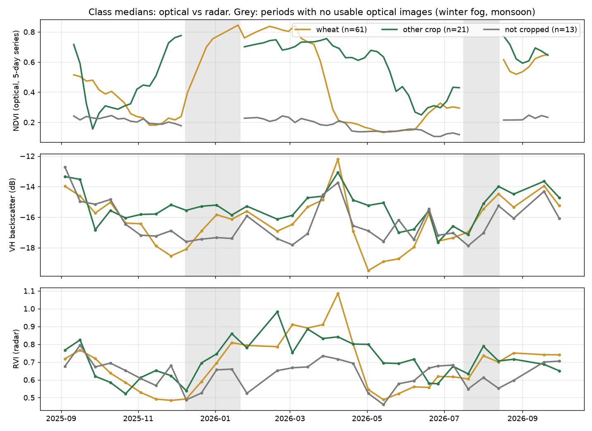
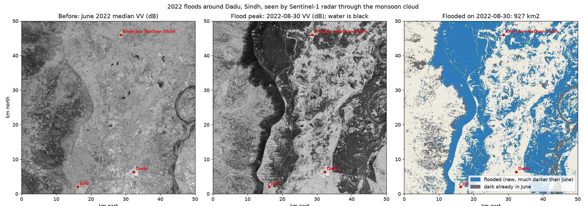
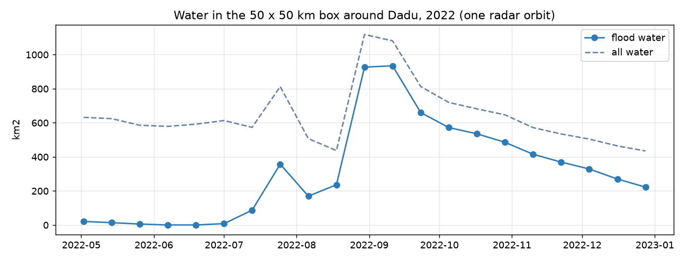

# crop_project

Crop health in Punjab from space. Pulls free Sentinel-2 satellite images for any spot,
masks out clouds, and tracks greenness, water and moisture indices every ~5 days.

A learning project: I'm using it to build up satellite imaging and ML skills step by step,
alongside Stanford CS229. See the [roadmap](#roadmap) for where it's going.


The panels above are a 400 m block of farmland between Raiwind and Kasur, Sep 2025 – Sep 2026.
Punjab's whole farming year is visible: rice peaking in September, the harvest dip in Oct–Nov,
wheat peaking in early March, the April harvest, fallow summer, and rice again.


## Indices

| Index | Measures | Formula | Pixel size |
|---|---|---|---|
| **NDVI** | greenness | (NIR − red) / (NIR + red) | 10 m |
| **NDWI** | open water | (green − NIR) / (green + NIR) | 10 m |
| **NDMI** | moisture in leaves and soil | (NIR narrow − SWIR1) / (NIR narrow + SWIR1) | 20 m |
| **EVI** | greenness, less saturated in dense crops, less affected by haze | 2.5 (NIR − red) / (NIR + 6 red − 7.5 blue + 1) | 10 m |
| **NDRE** | chlorophyll, via the red edge; keeps responding where NDVI flattens | (NIR narrow − red edge 1) / (NIR narrow + red edge 1) | 20 m |

Adding another index is one entry in the `INDICES` table at the top of `s2_indices.py`.

## How it works

```
Sentinel-2 L2A scenes on Microsoft Planetary Computer (free, no account)
  │  STAC search: point + date range + scene cloud < 50%, one scene per day
  ▼
For each scene (8 in parallel)
  │  lat/lon → UTM metres → pixel window
  │  HTTP range reads of just that window from the Cloud-Optimized GeoTIFFs,
  │    only for the bands the chosen indices need, plus the SCL cloud classification
  │  20 m bands (B05, B8A, B11, SCL) upsampled to the 10 m grid with nearest neighbour
  │  keep vegetation / soil / water pixels, drop the scene if < 80% of the square is clear
  │  reflectance = (DN − 1000) / 10000   (offset applies from processing baseline 04.00)
  │  each index per pixel → mean and spread over the square
  ▼
output/indices.csv, indices_timeseries.png, indices_map.png
```

Only a few hundred KB are downloaded per band per scene, instead of the full ~100 MB tile,
so a year of all four indices takes about a minute.

## Setup (Windows)

Needs Python 3.12+.

```powershell
py -m venv .venv
.venv\Scripts\activate
pip install -r requirements.txt
```

## Run

```powershell
python s2_indices.py                              # default: farmland between Raiwind and Kasur
python s2_indices.py --lat 31.30 --lon 74.07      # any other spot (copy lat/lon from Google Maps)
python s2_indices.py --indices NDVI,NDMI          # only some indices (fewer bands, faster)
python s2_indices.py --size 200                   # smaller square = closer to a single field
python s2_indices.py --start 2023-11-01 --end 2024-05-31   # one wheat season
```

Run `python s2_indices.py --help` for all options (cloud thresholds, map size, output folder).

## Reading the charts

- **NDVI**: below ~0.2 is bare soil or a harvested field; above ~0.6 is dense healthy crop.
- **NDWI** is mostly negative over farmland; it goes above 0 only over open water.
- **NDMI** rises with water in the canopy and in wet soil, and drops below 0 when fields dry out.
- **EVI** follows NDVI on a lower scale, but saturates less at peak growth and shrugs off thin haze.
- **NDRE** peaks and starts falling earlier than NDVI as the wheat ripens and loses chlorophyll.
- The shaded band is the spread across the square. It's wide because a 400 m square covers
  several fields with different crops.
- In the NDMI map the 20 m pixels show as visibly bigger blocks.

## Per-field statistics

`s2_fields.py` does the same per field instead of per square. Field boundaries come from
`fields.geojson` (drawn on geojson.io, one polygon per field, with a `name` property).
Each field is shrunk inwards by 10 m so only pixels entirely inside it count, and a field is
skipped on a date unless at least 80% of its own pixels are cloud-free.

```powershell
python s2_fields.py                                  # fields.geojson, all indices
python s2_fields.py --fields my_fields.geojson --indices NDVI,NDMI
python s2_fields.py --buffer 20                      # shrink by 20 m (stricter for 20 m bands)
```

Before downloading anything it prints each field's size and how many pure 10 m and 20 m
pixels it has, since small fields leave very few 20 m pixels for NDMI and NDRE.
Results go to `output/fields.csv` (one row per field per clear date: mean, median and spread
of each index), `fields_timeseries.png` and `fields_map.png`.


The three fields here looked like one block of rice in September, but they are farmed
differently the rest of the year: `field1_west` follows the classic rice–wheat rotation
(wheat peaks in March, then bare soil until it is flooded for transplanting in late June:
NDVI drops to 0.03 and NDWI reaches its yearly high on 27 June, then NDMI jumps as the rice goes in),
while both eastern fields carry shorter crops in winter and green up again by June.


### Catching what the cloud mask misses

The SCL cloud mask misses cloud edges and, above all, haze: on 20 Feb 2026 it called the
fields 100% clear while haze cut NDVI by a third. So every observation is also checked,
and suspicious ones are **flagged, not dropped** (`flag` and `haze_score` columns in `fields.csv`,
hollow points on the chart):

| Check | Rule | Catches |
|---|---|---|
| Cloud edges | grow SCL cloud and shadow by 2 pixels (`--cloud-buffer`) | the fringe around clouds |
| `haze` | the date's scene is hazy: the median blue − red of its dense-crop fields (NDVI > 0.5) is above 0.006 (`--haze`); every field on that date is flagged | haze and smog, which brighten blue more than red, including over bare fields where the test itself can't see it |
| `dip` | NDVI more than 0.1 below both neighbouring dates, each within 20 days (`--dip`, `--dip-days`) | any short dip that recovers; a harvest doesn't recover, so it isn't flagged |

Haze is judged per scene, not per field. The first version flagged any single field above
0.008 and spread that to its neighbours; calibrated on 3 fields, it held up there, but across
100 fields some healthy dense wheat sits naturally at +0.009 and one false alarm spread over
kilometres (a clear 21 January was flagged for 87% of fields). The median over many dense
fields separates cleanly: known hazy dates +0.011 to +0.022, known clear dates +0.002 or lower.
The scene's own aerosol estimate (the AOT band) turned out useless for this: it was normal on
the haziest day, because haze it had estimated correctly would already have been removed.

`fields_flagged.png` shows every flagged date in true colour next to the clearest date, so
each flag can be checked by eye:



## Regular 5-day series and crop seasons

`s2_series.py` turns each field's irregular, partly flagged observations into one value every
5 days on a grid shared by all fields (from 1 September), which comparisons and classifiers need.
It reads `output/fields.csv`, so it needs no network and runs in seconds.

```powershell
python s2_series.py                       # after s2_fields.py
python s2_series.py --window 7            # force Savitzky-Golay smoothing over 7 steps (35 days)
python s2_series.py --max-gap 20          # leave gaps over 20 days empty instead of 30
```

1. Flagged observations are dropped.
2. Linear interpolation fills the grid, but never across a gap longer than 30 days and never
   before the first or after the last observation. Those stay empty: the 32-day monsoon gap
   (15 Jul to 16 Aug 2026) is where rice went from mud to full crop, and a straight line through
   it would be off by about 0.2 NDVI.
3. Savitzky-Golay smoothing, with the window chosen by **hold-out validation**: hide 10% of the
   clear observations, rebuild the series without them, and measure the error at the hidden dates.
   Here plain interpolation won (mean error 0.038 NDVI); every smoothing window did worse, and wider
   windows worse still, because the flags had already removed the noise and smoothing only blurs the
   harvest cliffs, where the largest errors are.
4. Phenology per field and crop season: peak, and start and end where the curve is halfway between
   its base and its peak. Anything in a gap or outside the data is left empty with a note.

Outputs: `series.csv` (long format), `series_matrix.csv` (one row per field, one column per index
and date: the feature matrix for a classifier), `phenology.csv` and `series.png`.



`field1_west`'s wheat season runs from 6 Jan to 31 Mar 2026 (84 days between the halfway points,
peak 0.86 on 5 Mar); `field1_southeast`'s short winter crop from 31 Dec to 10 Feb (40 days).

Downloaded pixel windows are cached in `cache/` (about 3 MB for a year), keyed by scene, band and
window, so re-running `s2_fields.py` takes about 10 seconds instead of one to four minutes.

## Labelled dataset: 100 fields near Raiwind

The first machine-learning step needs labelled fields. `labels/fields.geojson` holds 100 of
them, sampled, outlined and labelled per season (Rabi and Kharif 2026), each label with its
source and confidence. The rules are in [LABELS.md](LABELS.md); the full decision log, with
the reasons and the mistakes caught, is in the Step 7 summary page.

```powershell
python s2_sample.py                                     # 1. one random point per km² in 10 x 10 km
python s2_delineate.py --calibrate fields.geojson       # 2. check the boundary threshold on known fields
python s2_delineate.py                                  #    grow a field outline at every point
python s2_label_sheets.py --blind                       # 3. true-colour sheets for the 30 test fields
python s2_review.py                                     # 4. apply review + blind labels -> labels/fields.geojson
python s2_fields.py --fields labels/fields.geojson --buffer 5 --out output/labels   # 5. series
python s2_series.py --csv output/labels/fields.csv --out output/labels
python s2_cluster.py                                    # 6. k-means on the 70 training fields
python s2_review.py                                     # 7. merge labels/train_labels.csv as well
```

- **Sampling:** one random point per 1 km cell, so nobody chooses the easy fields; 2 km strips
  are the spatial cross-validation blocks, and 6 points per strip are the blind test set.
- **Boundaries:** grown from each point over pixels whose monthly NDVI through the whole year
  matches the point's, so neighbouring fields that only differ in one season stay apart.
  Threshold 0.08, calibrated by overlap (IoU) with known fields; ragged results are retried
  stricter; points on ridges and paths join the field they touch. 13 flagged outlines were
  reviewed against sub-metre imagery and NDVI: 4 kept, 9 non_crop, none dropped.
- **Test labels (30):** labelled blind, from true-colour chips and visible RGB only, never NDVI,
  so they stay independent of what the model learns from. They were labelled by Claude at the
  author's request, and recorded as such.
- **Training labels (65):** k-means (k = 6) on the training fields' NDVI years, with the test
  fields left out so their labels can't leak in; each cluster named from its curve, and the
  13 fields that fit their cluster poorly read one by one. Source `curve`.



| Rabi 2026 | Train | Test |
|---|---|---|
| wheat | 44 | 17 |
| other_winter | 9 | 3 |
| non_crop | 6 | 5 |
| short_winter | 6 | 0 |
| unknown | 2 | 3 |
| fallow / sugarcane / orchard | 1 / 1 / 1 | 1 / 1 / 0 |

Fields here are small (median about 1 acre; 61 have fewer than 10 pure 20 m pixels), so the
traced outlines are shrunk by 5 m, half a pixel, rather than 10 m. Rare classes will need
merging before training, and most labels are a model's reading rather than a farmer's answer.

## Crop classification (Rabi 2026)

`s2_classify.py` predicts each field's Rabi crop as wheat, other_crop (other_winter,
short_winter, sugarcane, orchard) or not_cropped (non_crop, fallow); `unknown` is left out.
That gives 68 training and 27 test fields.

```powershell
python s2_classify.py            # cross-validation on the training fields only
python s2_classify.py --test     # the one look at the blind test fields (refuses a second run)
```

- **Features:** set A is every index on every 5-day date from October to May (200 columns, more
  than the 68 fields); set B is 16 hand-made ones (monthly NDVI, peak and its date, days above
  0.5, NDMI/NDWI in March, EVI peak, NDRE in February).
- **Models:** a majority baseline, L2 logistic regression, an RBF SVM, a random forest and
  gradient boosting. All except boosting use balanced class weights; boosting gets balanced
  sample weights. C is tuned inside the training strips only (nested leave-one-strip-out).
- **Choosing:** by leave-one-strip-out balanced accuracy, taking the simplest model within one
  standard error of the best. Random 5-fold CV is reported only to measure the neighbour effect.
  The choice was fixed before the test set was opened.

| | Accuracy | Balanced accuracy |
|---|---|---|
| Majority baseline (always wheat) | 65% | 33% |
| Spatial CV, set B + logistic regression | 99% (±3) | 98% |
| Random CV, same model | 96% | 96% |
| **Blind test (27 fields, once)** | **89% (±12)** | **81%** |



What it shows:

- **Seven of eight models tie at about 98%** in spatial CV, and 16 hand-made features do as well
  as 200 raw ones. The training labels came from clustering these same curves, so CV mostly
  measures how well a model re-finds the clusters.
- **The blind test is 10 points lower** (17 points lower for balanced accuracy). That gap measures
  how much the curve-based evaluation flattered the model. Wheat is 17 of 17; all three errors
  are in the rarer classes:
  - two non_crop fields with green outlines (winter NDVI 0.64 and 0.56) were called other_crop.
    Every training non_crop field has winter NDVI of 0.26 or less, so the model never saw green
    non-crop land. g0000 is a line of canal-bank trees. g0202's point sits on a road verge, but
    its outline covers the green patch beside it, so the label describes the point while the
    series describes the outline, and the model may well be right about the outline;
  - one early winter crop, harvested in early March, was called wheat. The same confusion is
    the only spatial-CV mistake (g0608, short_winter).
- **High-confidence test labels: 14 of 14 right.** Medium: 6 of 8; low: 4 of 5.
- **No measurable neighbour effect** (random CV is 2 points *lower*). With near-perfect scores
  there is no room for a gap, so this neither confirms nor rules it out.
- **Dropping the 14 low-confidence training labels hurt** (99% → 94%). With 68 fields, more
  labels beat cleaner labels here.
- **April NDVI is the strongest feature:** wheat is harvested in April, while other crops stay
  green and bare land stays low.



## Crop map of the whole square (data cube)

`s2_cube.py` runs the Step 8 model on every 10 m pixel of the 10 x 10 km square, not just the
100 fields. odc-stac turns the STAC search into a lazy xarray cube (55 scenes, 1000 x 1000 pixels,
8 bands); the per-field pipeline is then repeated per pixel: SCL cloud mask grown by 2 px, the
7 hazy dates from Step 7 dropped, the dip rule, 5 indices, the regular 5-day series (max gap 30 days)
and the 16 set-B features, then class probabilities. Probabilities are averaged over 3 x 3 pixels,
and a pixel whose top probability is below 0.6 is marked uncertain.

```powershell
python s2_cube.py --prefetch 4    # download up to 4 blocks per call (each block ~1-3 min)
python s2_cube.py                 # build the map from the cached blocks (~1 min)
```

The square is read in 16 blocks of 250 x 250 pixels (plus a 2-pixel halo for the cloud buffer);
raw pixels are cached in `cache/cube/` (about 480 MB), so only the first run downloads.
For the fields inside the first block, the median of the per-pixel features matched the Step 7
field features to two decimals, so the cube reproduces the field pipeline.





| Class | Map (pixel count) | 100 random points (labels) |
|---|---|---|
| wheat | 50.5% (5049 ha) | 61% ± 10 |
| other crop | 22.8% (2281 ha) | 21% ± 8 |
| not cropped | 12.8% (1278 ha) | 13% ± 7 |
| uncertain | 13.9% (1393 ha) | – |

- **Other crop and not cropped match the random sample;** wheat is low, because 9 of the 61
  wheat points fall on pixels marked uncertain. None of the wheat points is mapped as another class.
- **88% of the uncertain pixels lie on a boundary between classes:** mixed pixels at field edges,
  roads and tree lines. With fields of about one acre, edges are a large share of the land.
- The map agrees with 83% of the 95 labelled sample points; the training points are not an
  independent check, and the test points were already used once, so this is a sanity check only.
- Counting pixels gives a biased area when the map has errors; the random sample is the
  unbiased estimate, which is why both are shown.

## Radar: Sentinel-1 for the fields, and the 2022 floods

Radar satellites send their own microwaves and measure what bounces back, so they see through
cloud, fog and darkness. The data is Sentinel-1 RTC (terrain-corrected) from Planetary Computer,
always from one viewing geometry, because backscatter depends on the angle the radar looks from.

```powershell
python s1_fields.py    # radar series for the 100 fields, compared with NDVI
python s1_flood.py     # 2022 flood map around Dadu, Sindh
```

**Fields (`s1_fields.py`).** 33 passes (descending orbit 34), September 2025 to September 2026;
7 of them fall in the winter-fog and monsoon gaps where the optical series has nothing.



- Cross-polarised backscatter (VH) follows NDVI only loosely: r = +0.52 over 2019 radar/optical pairs
  within 3 days (VV: +0.16). It does show wheat greening up during the fog gap and, very clearly,
  the bare, dry fields after the April harvest (about −19.5 dB).
- On 6 April every class jumps by about 3 dB at once: a change in the whole scene (most likely wet
  soil after rain), the radar's version of a hazy day.
- Radar alone separates the three classes much less well than optical (spatial CV balanced accuracy
  57–64% against 98%; baseline 33%). Adding the 24 radar features to the 16 optical ones made
  logistic regression worse (87%): more, noisier features for 68 fields. The labels came from optical
  curves, which favours optical; fields of about one acre (~40 pixels) also leave a lot of speckle.

**Floods (`s1_flood.py`).** A 50 × 50 km box around Dadu, Johi and Khairpur Nathan Shah, which were
submerged in September 2022; 21 passes from May to December 2022 at 20 m. Water is very dark in VV;
the threshold (−13.7 dB) comes from Otsu's method on the darkest date. A pixel counts as flooded only
if it is below the threshold **and** at least 3 dB darker than in June: dry, smooth desert soil is
dark to radar as well (a June Sentinel-2 image shows only 4% of the June-dark area is water).





- Flooded area rose from under 10 km² in June to **935 km²** on 11 September, and 223 km² was
  still under water at the end of December.
- Against a cloud-free Sentinel-2 image of 10 September (NDWI > 0 as water): 96% of the radar flood
  pixels were water in the optical image, and the radar found 87% of the optical water outside the
  areas that were already dark in June.
- Without the 3 dB rule, the same map showed 106 km² of "flood" in May, before any flood.

## Spectral signatures

`spectral_signatures.py` samples all 12 Sentinel-2 L2A bands at five verified pixels
and plots reflectance against wavelength: a wheat field at its peak, the same field after
harvest, the Ravi at Shahdara, Walled City rooftops, and a cloud.

```powershell
python spectral_signatures.py      # edit TARGETS in the file to try your own pixels
```


## Roadmap

Each step adds a feature and teaches one concept.

**Satellite fundamentals**
- [x] NDVI time series from Sentinel-2 with cloud masking
- [x] Spectral signatures: all bands for crop, soil, water, city and cloud pixels
- [x] More indices: NDWI, NDMI (SWIR, 20 m), EVI, NDRE (red edge)
- [x] Real field boundaries (GeoJSON polygons) instead of a square
- [x] Better cloud masking: explain every dip, buffer cloud edges
- [x] Local cache + gap-filled, smoothed 5-day time series

**Machine learning (CS229)**
- [x] Labelled dataset of 60–100 fields by crop system
- [x] Crop classification: logistic regression, SVM, gradient-boosted trees, with spatial cross-validation
- [x] Write-up: [the report](paper/main.tex) (LaTeX; figures, tables and numbers generated by `s2_paper.py`)

**Radar and deep learning**
- [x] Area-scale processing with odc-stac + xarray: a 10 m crop map of the 10 x 10 km square
- [x] Sentinel-1 radar time series; 2022 flood mapping
- [ ] U-Net crop map with TorchGeo
- [ ] Benchmark geospatial foundation models (Prithvi, Clay) against the classical baseline

## Data

Contains modified Copernicus Sentinel data, accessed through
[Microsoft Planetary Computer](https://planetarycomputer.microsoft.com/dataset/sentinel-2-l2a).
