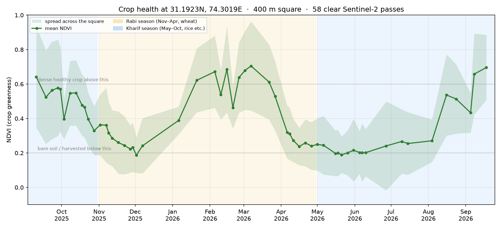
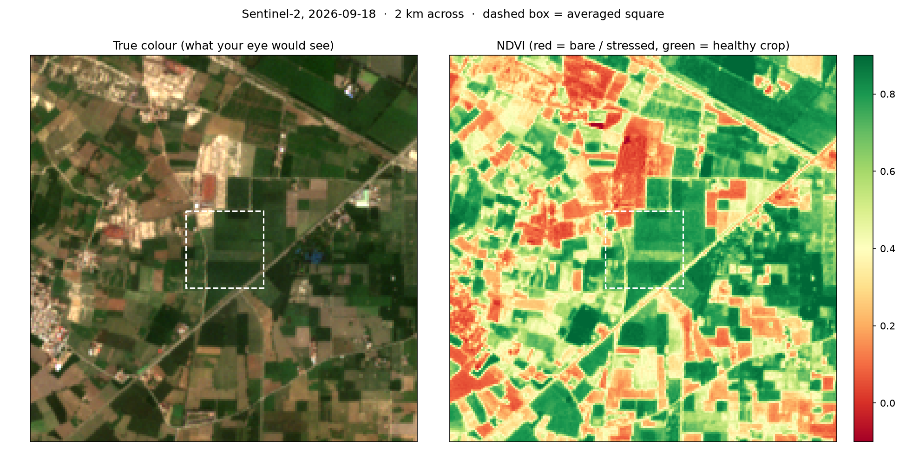

# crop_project

Crop health in Punjab from space. Pulls free Sentinel-2 satellite images for any spot,
masks out clouds, and plots how green the crops there have been every ~5 days.

A learning project: I'm using it to build up satellite imaging and ML skills step by step,
alongside Stanford CS229. See the [roadmap](#roadmap) for where it's going.



The curve above is a 400 m block of farmland between Raiwind and Kasur, Sep 2025 – Sep 2026.
Punjab's whole farming year is visible in it: rice peaking in September, the harvest dip in
Oct–Nov, wheat peaking in early March, the April harvest, fallow summer, and rice again.



## How it works

```
Sentinel-2 L2A scenes on Microsoft Planetary Computer (free, no account)
  │  STAC search: point + date range + scene cloud < 50%, one scene per day
  ▼
For each scene (8 in parallel)
  │  lat/lon → UTM metres → pixel window
  │  HTTP range reads of just that window from the Cloud-Optimized GeoTIFFs:
  │    B04 red, B08 near-infrared (10 m), SCL cloud classification (20 m → 10 m, nearest)
  │  keep vegetation / soil / water pixels, drop the scene if < 80% of the square is clear
  │  reflectance = (DN − 1000) / 10000   (offset applies from processing baseline 04.00)
  │  NDVI = (NIR − red) / (NIR + red)  → mean and spread over the square
  ▼
output/ndvi.csv, ndvi_timeseries.png, ndvi_map.png
```

Only a few hundred KB are downloaded per band per scene, instead of the full ~100 MB tile,
so a year of data takes about 30 seconds.

## Setup (Windows)

Needs Python 3.12+.

```powershell
py -m venv .venv
.venv\Scripts\activate
pip install -r requirements.txt
```

## Run

```powershell
python s2_ndvi.py                              # default: farmland between Raiwind and Kasur
python s2_ndvi.py --lat 31.30 --lon 74.07      # any other spot (copy lat/lon from Google Maps)
python s2_ndvi.py --size 200                   # smaller square = closer to a single field
python s2_ndvi.py --start 2023-11-01 --end 2024-05-31   # one wheat season
```

Run `python s2_ndvi.py --help` for all options (cloud thresholds, map size, output folder).

## Reading the chart

- **NDVI** measures greenness. Healthy leaves absorb red light and reflect a lot of near-infrared.
- Below ~0.2 is bare soil or a harvested field; above ~0.6 is dense healthy crop.
- The shaded band is the spread across the square. It's wide because a 400 m square covers
  several fields with different crops.

## Spectral signatures

`spectral_signatures.py` samples all 12 Sentinel-2 L2A bands at five verified pixels
and plots reflectance against wavelength: a wheat field at its peak, the same field after
harvest, the Ravi at Shahdara, Walled City rooftops, and a cloud.

```powershell
python spectral_signatures.py      # edit TARGETS in the file to try your own pixels
```


## Roadmap

Each step adds a feature and teaches one concept.

**Satellite fundamentals**
- [x] NDVI time series from Sentinel-2 with cloud masking
- [x] Spectral signatures: all bands for crop, soil, water, city and cloud pixels
- [ ] More indices: NDWI, NDMI (SWIR, 20 m), EVI
- [ ] Real field boundaries (GeoJSON polygons) instead of a square
- [ ] Better cloud masking: explain every dip, buffer cloud edges
- [ ] Local cache + gap-filled, smoothed 5-day time series

**Machine learning (CS229)**
- [ ] Labelled dataset of 60–100 fields by crop system
- [ ] Crop classification: logistic regression, SVM, gradient-boosted trees, with spatial cross-validation
- [ ] Write-up

**Radar and deep learning**
- [ ] Area-scale processing with odc-stac + xarray
- [ ] Sentinel-1 radar time series; 2022 flood mapping
- [ ] U-Net crop map with TorchGeo
- [ ] Benchmark geospatial foundation models (Prithvi, Clay) against the classical baseline

## Data

Contains modified Copernicus Sentinel data, accessed through
[Microsoft Planetary Computer](https://planetarycomputer.microsoft.com/dataset/sentinel-2-l2a).
